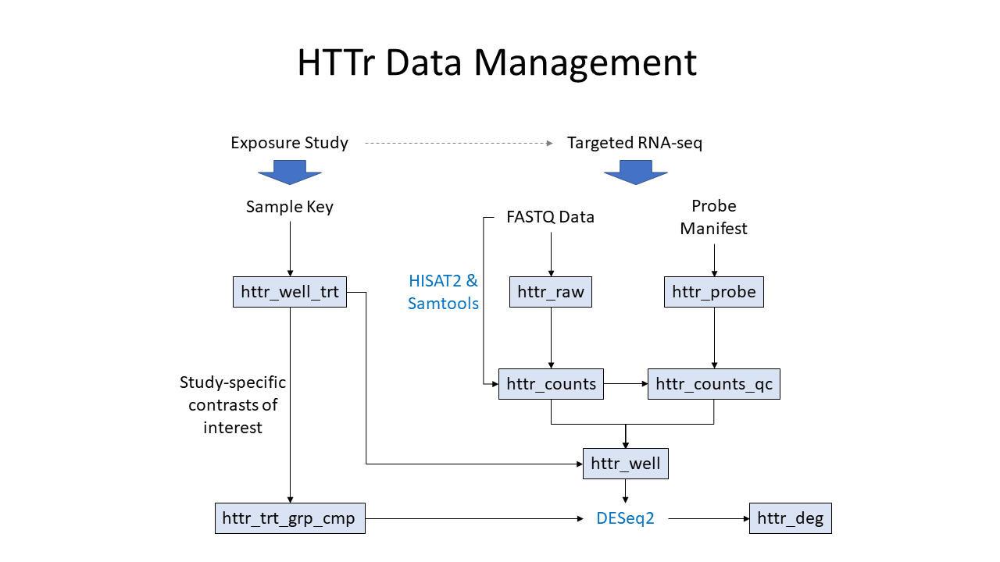

HTTr Pipeline (httrpl) Vignette
===============================


Introduction
------------

The primary purpose of this pipeline is to process High-Throughput Transcriptomics (HTTr) data generated using targeted RNA-seq, starting from raw fastq files. 
This vignette walks through the main steps of the pipeline. 
Currently, the only targeted RNA-seq implementation that is used is the TempO-seq platform provided by BioSpyder, although most of the analysis methods should be generalizable to other implementations such as RASL-seq. 
Also, the pipeline has been designed such that individual functionality can be accessed without running the full pipeline, wherever possible. 
The pipeline is currently designed to primarily use [MongoDB](https://www.mongodb.com/) as a back-end for data-management. 
While a database back-end is highly advisable for large data sets, it may be overkill for smaller studies.
The current version of httrpl also has the option to store all output directly to disk as JSON files, without the use a database server.

The primary data levels handled by this pipeline are:

0. Raw data in FASTQ format - individual sequenced reads and quality scores
1. Count data - an integer value for each probe in each sample
2. Log2 Fold-change data - for each probe in each condition or pairwise comparison

Below is a graphical outline of the higher level architecture for MongoDB:



Please see the [httrpl package README](../README.md) for instructions on how to properly install httrpl in Linux or Windows environments.
This README includes instructions for installation of the httrpl python environment, unit testing, and installing the included httrlib R package which contains many functions for processing HTTr data, quality control evaluation, and accessing MongoDB/JSON data. 

If using MongoDB, the DB administer will need to create a corresponding database for each study with appropriate user credentials.
Once this is done you can access MongoDB from R environment:

Test your mongoDB access with the below command:
```r
collection <- openMongo(db_host="serverURL", db_name="studyDBname", username="usernameforDB", passwd="userpassword", collection="nameofDBcollection")
```

If using MongoDB-free options, you can access JSON files from the R environment:

```r
collection <- openMongo(output_dir="path/to/JSON/collections/", collection="nameofJSONcollection")
```

The steps below populate each collection in the defined DB schema for each study/project.


## 1. Database and Credential Setup

### A. MongoDB Back-End

The pipeline code is currently designed such that each study should have its own independent database.
Multiple study databases can be hosted on a single MongoDB server, although the pipeline also supports hosting databases across multiple servers. 
Creating a new MongoDB is straightforward - no collections or schema need to be defined, as those will be defined once the pipeline populates the database, so this is just a matter of giving the database an informative name (letters, numbers, and underscores only) and creating user accounts. 
MongoDB user permissions are managed at the database level, so a user can be given access to one specific database on a server, and user permissions can be managed separately for each database. 
See the documentation for MongoDB for more general information on creating and managing MongoDB databases, and pipeline users will likely have to coordinate this step with a database administration. 

The key things to setup are:

+ For each dataset, a new, empty database should be created in MongoDB.
+ Users who will actively pipeline data will need read and write access to the database.
+ Users who only need to pull results out of the database can be given read-only access.

The pipeline code needs to know at least 4 pieces of information to communicate with MongoDB:

+ Host = The URL or IP address of the MongoDB server.
+ Name = The name of the study database.
+ Username = The username to use when connecting to the database.
+ Password = The password to use when connecting to the database.
+ Authentication Mechanism *(Optional)* = The specific authentication mechanism to use when connecting to the MongoDB server.
+ Authentication Source *(Optional)* = The database to use for matching user credentials (when credentials are stored in a separate database).

To avoid exposing usernames and passwords, this pipeline provides several methods for users to store usernames and passwords in protected files, explained in the sub-sections below.

#### Private Keychain File (R/Python, Linux or Windows)

The preferred method for storing user credentials in a private file is to use the addKey.py script in the httrpl package.
This script allows you to store different usernames/passwds for different hosts and databases, and also allows you to store the additional authorization parameters needed for some server configurations.
The easiest way to setup the private file or add a new set of user credentials is to run the following script from the command line: 
```bash
python3 path/to/httrpl/bin/addKey.py
```
This will ask for the a host, db name, username, password, and optional authorization parameters, and then stores this set of values together in a file called "~/.mongopw".
This is actually just a JSON-formatted file, so you can also create/edit the appropriate object in either python/R and write out with the json/jsonlite interfaces, or directly edit the file with a plain text editor.
The format looks like this:
```
[
 {"host":"", "db":"", "user":"", "passwd":"", "authMechanism":"", "authSource":""},
 {"host":"", "db":"", "user":"", "passwd":"", "authMechanism":"", "authSource":""}
]
```
In both the R and Python DB interfaces, this file gets checked first, and if there's an entry with matching host and db for the current connection, it will be used as the user/passwd credentials.
If no host/db match is found here the code defaults to the alternate option below.

#### Default Username and Password File (R/Python, Linux Only)

Create a file called `~/.mngdb/passwd` and make this a simple text file with one line following this format:
```
username:passwd
```
This will become the default username and password any time you connect to a DB using the httrpl code without specifying a username/password.
This option will likely be deprecated in future versions in favor of the private keychain file described above.

#### Global Session Options (R Only, Linux or Windows)

You can also store a default host, username, and password in the R global environment options.
This can be done at the beginning of an R script or session, and is currently the easiest way to manage DB login info when running the R interface on Windows, but the credentials are not stored privately for the individual user. 
Below are example commands for setting these options in R:
```r
options(httrDefaultHost="servername")
options(httrDefaultUser="usernameforDB")
options(httrDefaultPasswd="userpassword")
```

Once these options are set, you only need to specify the DB name when creating DB connections or running other DB interface functions.

### B. JSON Files (No MongoDB Server)

*Note* The MongoDB-free options were built following the same schema that was designed for MongoDB users. All MongoDB collections will be stored as individual JSON files if using MongoDB-free options.

The pipeline code is currently designed such that each study should have its own independent directory for storing all JSON files.
Creating a new dataset using MongoDB-free options is straightforward - no collections or schema need to be defined, as those will be defined once the pipeline populates the JSON files, so this is just a matter of giving the JSON directory an informative name (letters, numbers, and underscores only). 

The key things to setup are:

+ For each dataset, a new, empty JSON directory should be created.
+ For many functions in the `httrlib` R package, as well as the primary alignment and counting steps, MongoDB-free options are set by the `output_dir` parameter. This parameter should be a full file path to the JSON directory for a dataset and tells the package to connect to, process, and output all MongoDB collections as JSON files instead.

Aside from explicitly defining the `output_dir` parameter for all `httrlib` functions, a global option can be used instead for R code. This can be done at the beginning of an R script or session:
```r
options(output_dir="path/to/JSON/collections/")
```


## 2. Identify Probe Manifest

The probe manifest for targeted RNA-seq includes probe names and sequences designed to target specific gene transcripts. 
This manifest is typically delivered by the targeted RNA-seq lab or service provider and includes probe information, target gene annotations, and any attenuator information.

Thus, the pipeline requires that the probe manifest information be captured in the database using a standardized schema, in a collection named `httr_probe`, using input files to populate the fields.

The current schema has the following fields (data types noted in *italics*):

+ `index` *(int)* = represents row id probe manifest. This keeps track of the order of probes as the probe manifest gets updated.
+ `probe_name` *(str)* = represents Gene_ID
+ `probe_idnum` *(int)* = represents the integer part at the end of the probe name.
+ `probe_seq` *(str)* = represents the 50 nucleotide probe sequence
+ `transcripts` *(list of str)* = represents the List of transcripts targeted by this probe 
+ `entrez_id` *(str)* = represents the gene ID in NCBI Entrez DB
+ `gene_symbol` *(str)* = represents the official gene symbol of the target gene
+ `probe_flag` *(str)* = represents probes that are used for further analysis. Represented as `"OK"`.
+ `attenuation` *(int)* = represents the fold-attenuation used fo this database data set.

An example probe manifest can be found within the httrpl repository here:  `httrpl/httr/data/httrpl_automationTestData/httr_probe_data/human_wt_1.2.csv`.

The `httrlib` R package now includes three helper functions for setting up the probe manifest for a particular study:

+ `validateProbeManifest` - validates a probe manifest (either a `data.frame` or CSV file) to confirm it matches the current DB schema.
+ `insert_probe_manifest` - inserts a validated probe manifest into the `httr_probe` collection of a study database.
+ `create_fasta_from_probe` - creates a FASTA file from a probe manifest file or `httr_probe` collection, which is required for the sequence alignment step.


## 3. Identify Sample Treatments

Treatment information for sample (metadata) are captured in .csv template and contains all experimental metadata for a given HTTr dataset.

An example template can be found within the httrpl repository here: `httrpl/httr/data/httrpl_automationTestData/config/test_httrpl_sampleKey.csv`.

Please refer below to identify the required fields for the `httr_well_trt` collection:

+ `sample_id` *(str)* = unique ID that was assigned to the plate well and should match the sample_id naming in the fastq files.
+ `plate_id` *(str)* = identifier of the plate this sample was on
+ `well_id` *(str)* = well that this sample was in on the plate
+ `trt_name` *(str)* = Name for the treatment or category of this well and the preferred format is `(chem_id)_(dose_level)_(conc)(conc_unit)` and an additional `_(cell_type)` suffix if study contains multiple cell types
  + For vehicle controls, this field is set to the same value as `chem_id`
  + For untreated controls, this field is set to `"Untrtd"`
  + For Bulk Lysate controls, this field is set to `"BL_(chem_id)"`
  + For Reference RNA mixes, this field is set to same value as `rna_src` (which is either `"UHRR"` or `"HBRR"`
+ `qc_flag` *(str)* = Flags that indicate known problems with the sample prior to sequencing (e.g. dosing errors from the Echo machine, cell viability problems). Standard values used across screening studies are:
  + `"OK"` = No QC problems
  + `"CELL_VIABILITY"` = This exposure condition failed cell viability thresholds based on imaging plates (we currently flag all
  + `"DOSEPLATE_FAIL"` = Echo log indicated error when preparing doseplate (thus all wells of this chemical or dose did not receive the intended exposure)
  + `"DISPENSE_FAIL"` = Echo log indicated error when dispensing chemicals on to the test plate (this individual well did not receive the intended exposure)

*Note:* Additional experimental metadata can be captured in this sample key .csv file including, but not limited to, `stype`, `media`, `timeh`, `rna_src`, `chem_id`, `conc`, `conc_unit`, `dose_level`, `block_id`, `pg_id`, `culture_id`, `fq_file`, etc.

The httrlib R package now includes several helper functions for validating a sample key .csv file and inserting relevant data fields into the `httr_well_trt` and `httr_chem` collections.

Key steps of this process are:

1) Validate metadata .csv file
2) Reshape metadata file to fit collection schema
3) Write metadata to DB and store httr_well_trt schema.

The httrlib R package has a convenience wrapper function, `sampleID_wrapper`, that can perform all of the above steps.
See httrlib R package documentation for description of this wrapper function and all additional functions for processing sample key metadata.


## 4. Align and Count Reads

This step stores information about the raw data files and alignment results for each well in the `httr_raw` and `httr_counts` collections in database. 

The batch script `align_and_count.py` and config files will be used to run alignment & counting on all samples. 
Results are batched and then output to TSV by plate, and samples will also be pushed into the DB. 
Final output will be `httr_counts` collection. 

Generate `.json` config file specifying the sample_key, specific mongo DB information and biospyder probe manifest for the assay.

The config file should have the following fields in JSON format:

+ `threads` *(int)* = determines number of threads for HISAT2 sequence alignment; specify based on your processing needs
+ `dbg` *(boolean)* = set to true for additional output messages, helpful for troubleshooting
+ `rerun` *(boolean)* = if True all samples in sample key and any existing data within the DB will be overwritten; if False only process samples not currently in the target DB
+ `strict` *(boolean)* = if True process will quit on all warnings
+ `db_host` *(str)* = MongoDB server name; can be empty string if using MongoDB-free options
+ `db_name` *(str)* = target MongoDB name; can be empty string if using MongoDB-free options
+ `fq_path` *(str)* = path to directory containing raw fastq files; can be empty string, "", if sample key .csv file contains full path to fastq files in the `fq_file` column 
+ `sample_key` *(str)* = full path to user-created sample key .csv file
+ `db_fa` *(str)* = file path to fasta file (.fa)
+ `db_ind` *(str)* = file path to where HISAT2 genome index files will be created (.ht2 files) 
+ `batch_size` *(int)* = number of samples processed before writing results to DB; should generally be >= `threads`
+ `reindex` *(boolean)* = if True HISAT2 will re-create genome index files
+ `output_dir` *(str)* = determines MongoDB or JSON options, default is empty string, "", for MongoDB; provide full file path to JSON directory for MongoDB-free option

An properly formatted example config JSON file can be found within the httrpl repository:  `httrpl/httr/data/httrpl_automationTestData/config/test_httrpl_userConfig.json`.

+ Executable scripts are in `httrpl/httr/bin/`
+ Python modules are in `httrpl/httr/lib/`
+ R modules are in: `httrpl/httrlib/`

For running the alignment step, make sure your PATH environment variable points to the hisat2 and samtools libraries. For example, you can add the following lines to your .bashrc:
```bash
export PATH=/share/projects/HTTr/Tools/hisat2-2.1.0/:$PATH
export PATH=/share/projects/HTTr/Tools/samtools-1.9/bin/:$PATH
```

To run the pipeline, you must run the align_and_count.py command from the `httrpl/httr/bin/` directory and specify the config file that you create.  

Here is an example command to run the `align_and_count.py` script using an example config file and creating a log of the alignment run:
```bash
cd (localpath)/httrpl/httr/bin/
python3 align_and_count.py (localpath)/path/to/example_config.json &> (localpath)/path/to/logs/example.log &
```
Check the resulting `example.log` file for warnings and errors.

This step of the pipeline will create the `httr_raw` and `httr_counts`.
The schema for each resulting document in the `httr_raw` collection is as follows:

+ `path` *(str)* = Path on Linux servers where the fastq file is/was stored at time of processing
+ `fastq` *(str)* = Basename of the fastq file at time of processing
+ `sample_id` *(str)* = Sample ID matching httr_well_trt, typically comes from fastq file name
+ `mtime` *(datetime)* = Modification date/time of the fastq file on server file system.
+ `md5` *(str)* = MD5 checksum of the file that was stored on disk. - This should be always computed on the uncompressed data (if file is .gz or .bz, then decompress with zcat/gzcat/bzcat and pipe into md5sum)
+ `rd_len` *(int)* = The read length of the fastq file, should be 50 or 51 - useful to know if there was an extra base, any other value should be flagged in QC stage.

The schema for each resulting document in the `httr_counts` collection is as follows:

+ `sample_id` *(str)* = Plate_Well format
+ `raw_id` *(_id)* = Points to _id field in httr_raw for corresponding well/fastq file
+ `aln_cmd` *(str)* = The full bash command used to run hisat2 and samtools to process this fastq file
+ `host_name` *(str)* = The name of the machine or container where the counting pipeline was run 
+ `run_time` *(datetime)* = When this was run/entered into DB
+ `probe_cnts` *(list of dict)* = Dictionary structure of counts (keys = probe_name, values = integer counts)
+ `n_reads` *(int)* = Total number of reads in fastq file
+ `n_reads_mapd` *(int)* = Total number of uniquely mapped reads
+ `n_reads_ambig` *(int)* = Total number of ambiguously mapped reads
+ `mapd_frac` *(float)* = Fraction of reads mapped


## 5. Compute QC Metrics

In this step, various QC metrics are calculated which can be used to flag samples with poor quality and results are stored in the `httr_counts_qc` collection.

The httrlib R package has the function, `qcBatch`, which performs this step.
```r
#if using MongoDB
qcBatch(db_host=mongoDBhost, db_name=mongoDBname, calc_flag=TRUE, rerun=FALSE, debug=TRUE)

#if using MongoDB-free
qcBatch(calc_flag = TRUE, debug = TRUE, rerun = TRUE, output_dir = "/path/to/JSON/directory/")
```

*Note:* Users can change any of the QC metric thresholds, which are parameters in the `qcBatch` function. These thresholds should be tuned for each dataset with expert knowledge on the study design and origin of sequencing data (i.e. cell line, tissue, etc.). For example, in vitro HTTr studies at EPA generally use the lower/upper bounds of Tukey's outer fence (3*IQR) as threshold values for various QC metrics (except for `mapd_frac` and `n_reads_mapd` which are kept at default values). Please see the `getQCdefault` function to explore the default values in httrpl.

Required schema fields for `httr_counts_qc` are as follows:

+ `sample_id` *(str)* = Plate_Well format
+ `count_id` *(_id)* = Points to _id field in httr_counts for corresponding well/fastq file
+ `n_reads` *(int)* = Total number of reads in the fastq file that was aligned - propagated from httr_counts
+ `n_reads_mapd` *(int)* = Total number of reads that were uniquely mapped to probes 
+ `mapd_frac` *(float)* = Fraction of total reads that successfully mapped 
+ `bad_probe_count` *(int)* = The number of reads originating from "bad" probes 
+ `n_cov5` *(int)* = The number of probes with a read count >= 5 in this sample (not including bad probes), gives a baseline metric of how many probes are at least moderately expressed in the sample, helps flag low signal samples.
+ `n_sig80` *(int)* = The minimum number of probes that capture at least 80% of total reads in the sample (after removal of bad probes). This is a metric for the problem of too much signal concentrating in too few probes.
+ `top10_prop` *(float)* = The proportion of total reads captured by the top 10 highest signal probes in this sample (not including bad probes). 
+ `gini_coef` *(float)* = Calculation of the "Gini" coefficient, which is essentially the area under the cumulative density function of probe counts, ordered from lowest to highest.
+ `qc_flag` *(str)* = Indicator of known or suspected quality issue with this sample based on the count metrics above (e.g. the flags from httr_well_trt are not included here). Wells without QC problems get a standard "OK" or "GOOD" value (or empty string?) indicating no known problems.


## 6. Build Final Count Data Collection

This collection, `httr_well`, is built *after* the `httr_well_trt`, `httr_raw`, `httr_counts`, and `httr_counts_qc` collections have been populated.  
It pulls together useful metadata and probe counts from across those collections into one place for further analysis.  
Each entry in this collection will have the following required fields:
 
Fields that link to other collections:

+ `trt_id` = ID to matching document in httr_well_trt
+ `counts_id` = ID to matching document in httr_counts
+ `raw_id` = ID to matching document in httr_raw
+ `qc_id` = ID to matching document in httr_counts_qc

Fields pulled from `httr_well_trt`:

+ `sample_id` *(str)* = externally assigned identifier for this sample (should be unique for each document, typically plate_well format, usually inferred from the original fastq file name)
+ `plate_id` *(str)* = identifier of the plate this sample was on
+ `well_id` *(str)* = well that this sample was in on the plate
+ `trt_name` *(str)* = Name for the treatment or category of this well (NOT expected to be unique for each well, but instead should be useful for grouping related wells).

Fields propagated from `httr_counts`:

+ `n_reads` *(int)* = Total number of reads in the fastq file that was aligned - propagated from httr_counts
+ `probe_cnts` *(dict)* = Contains all the probe count data for this well, with keys = probe names *(str)* and values = counts *(int)*. All keys here should have corresponding entry in the platform used for this study. Any missing probe names are assumed to be 0. Bad probes will be removed prior to propagating from httr_counts.
+ `probe_cnts_nrm` *(dict)* = Contains all the normalized probe count data for this well.  
+ `qc_flag` *(str)* - This combines flags from `httr_well_trt`, `httr_raw`, and `httr_counts_qc`, with the flags from `httr_wll_trt` taking precedence.

To build the `httr_well` collection with documents for all wells using the python function `buildAllWells`:

```python
buildAllWells(httr_db = openMongo(host="MongoDBhost", db="mongoDBname"), rerun=False, log=PipelineLogger(strict=False, dbg=True))
```

`httr_well` level data can be retrieved and processed programmatically from DB. 
A list of commonly used DB commands can be found at the end of this document.


## 7. Identify Treatment Comparisons

The `httr_trt_grp_cmp` collection identifies the sample grouping to create pairwise comparisons with control groups.
This should only be set up after the `httr_well` collection is created and QC thresholds/flags are finalized.
Stores all relevant treatment group comparisons with descriptive meta-data for a single study.
Each entry in this collection corresponds to a single pairwise comparison to be analyzed with DESeq2 or some other differential expression method, and has the following required fields:

+ `trt_grp_id` *(str)* = A unique ID for this comparison that fully describes it (e.g. chemical-media-time-conc for pilot, chemical-conc for phase-I)
+ `ctrl_wells` *(list)* = List of dictionaries specifying the wells in the control group (not sure why this needs to be list of dicts instead of just list of sample_ids?), each list entry has fields:
        + `sample_id` *(str)* = Matches same field in `httr_well` collection
        + `plate_id` *(str)* = Matches same field in `httr_well` collection (Is there a reason to duplicate this here?)
        + `well_id` *(str)* = Matches same field in `httr_well` collection (Is there a reason to duplicate this here?)
+ `trt_wells` *(list)* = List of dicts specifying the wells in the treatment group, same structure as `ctrl_wells`.
+ `plates` *(list)* = List of strings containing union of plate IDs for all wells in both `ctrl_wells` and `trt_wells`.

Groupings can be done at any of the metadata type, such as `chem_id`, `cell_type`, `dose_level` etc.

To generate the `httr_trt_grp_cmp` documents for all test and reference chemicals, the httrlib R package provides several functions for defining treatment comparison groups based on several sample types. See httrlib package documentation for all possible `httr_trt_grp_cmp`-related functions.

An example of R code to generate the `httr_trt_grp_cmp` collection for a HTTr dataset with test chemicals in 8-point concentration response and reference checmials with varying numbers of concentration levels is shown here:
```r
#Generate treatment groups for all test chemicals (all media and time points)
all_test_grps <- allTestGroups(db_host = mongoDBhost, db_name = mongoDBname, well = "httr_well", exp_doses = 8, rerun = FALSE)
paste("allTestGroups returned list of", length(all_test_grps), "documents", sep = " ")

#Generate treatment groups for all reference chemicals (all media and time points)
all_ref_groups <- allRefDoseGroups(db_host = mongoDBhost, db_name = mongoDBname, well = "httr_well", exp_doses = c("TSA" = 1, "CUCURB" = 8, "ETOP" = 8, "ACTD" = 8), rerun = FALSE) #note -- exp_doses is a named list with values for the expected number of concentration groups for a given reference chemical 
paste("allRefGroups returned list of", length(all_ref_groups), "documents", sep = " ")
```


## 8. Run Differential Expression Analysis with DESeq2

This step runs fold-change estimation and differential expression testing from treatment group comparisons defined in the `httr_trt_grp_cmp` collection and stores results in the `httr_deg` collection.

The httrlib R package provides several functions for running this analysis using the `DESeq2` Bioconductor package (https://bioconductor.org/packages/release/bioc/html/DESeq2.html). *Note* that httrpl has been developed using DESeq2 v1.24.0 with R v3.6.0 and BioConductor v3.9.

There are two primary R functions for performing this step:

+ `runDESeq2ForChemCond` -- Runs DESeq2 on a single chemical dose-response series
+ `runDESeq2Single` -- Runs DESeq2 on a single contrast (e.g. single conc reference chemical, bulk lysate, or ref RNA QC samples)

A example of running this analysis for a set of test chemicals across an HTTr study is shown here (*Note* This example assumes only one type of cell culture medium, one time point, and one cell type for all test samples):
```r
# Setup
mongoDBhost = "host"
mongoDBname = "test_mongo_db"
DEBUG = TRUE
RERUN = FALSE
STRICT = TRUE
shrinkage = "normal" # Set to "none" to remove DESeq2 shrinkage
plate_effect = TRUE # Set to FALSE to remove plate effect from DESeq2 model equation

# Open DB connections
httr_trt_grp_cmp <- openMongo(db_host=mongoDBhost, db_name=mongoDBname, collection="httr_trt_grp_cmp")
httr_deg <- openMongo(db_host=mongoDBhost, db_name=mongoDBname, collection="httr_deg")

# Get the list of chemicals and plate groups in httr_trt_grp_cmp
chemicals <- httr_trt_grp_cmp$distinct("chem_id", mongoQuery(stype="test sample"))
pgs <- httr_trt_grp_cmp$distinct("pg_id", mongoQuery(stype="test sample"))
cat("Running DESeq2 on", length(chemicals), "dose-response series across", length(pgs), "plate groups.\n\n")

cat("\n-- Running all analyses with shrinkage =", shrinkage, "and plate_effect =", plate_effect, "--\n\n")
anl_name <- getAnlName(plate_effect=plate_effect, shrinkage=shrinkage)
# Loop over all plate groups
for(plate_group in pgs){
  #define chemicals by plate group
  chemicals <- httr_trt_grp_cmp$distinct("chem_id", mongoQuery(stype="test sample", pg_id = plate_group))
  cat("DESeq2 will be run on", length(chemicals), "dose-response series for", plate_group, "plate group.\n\n")
  for(chem_id in chemicals) {
    # Check if DB entries exist already:
    chem_trt_cnt <- httr_trt_grp_cmp$count(mongoQuery(stype="test sample", chem_id = chem_id, pg_id = plate_group))
    chem_deg_cnt <- httr_deg$count(mongoQuery(stype="test sample", chem_id=chem_id, anl_name=anl_name, pg_id = plate_group))
    if((chem_trt_cnt > 0) && (chem_deg_cnt == 0)) {
      cat("\n--- Running DESeq2 on", chem_id, "---\n\n")
      # Run the core DESeq2 pipeline on this dose-response series with these options
      deseq2_results <- runDESeq2ForChemCond(chem_id=chem_id, db_host=DB_HOST, db_name=DB_NAME, pg_id=plate_group, plate_effect=plate_effect, shrinkage=shrinkage, threads=THREADS, rerun=RERUN)
    } else if(chem_trt_cnt == 0) {
      cat("Skipping", chem_id, "- no entries in httr_trt_grp_cmp for this chemical.\n")
    } else if(chem_deg_cnt == chem_trt_cnt) {
      cat("Skipping", chem_id, "- results already exist in DB.\n")
    } else {
      # Unexpected number of entries in httr_deg
      stop(chem_id,  ", ", anl_name, " already has ", chem_deg_cnt, " entries in httr_deg, but there should be ", chem_trt_cnt, "\n")
    }
  }
}
```


Examples of commonly used DB access commands:
---------------------------------------------

These commands are for accessing pipelining results stored in a specific MongoDB.
The DB name and host variables are referred to as `my_db` and `my_host` respectively in the examples below, and assume the remaining credentials are stored in a private password file or global options.
If using MongoDB-free options, simply provide the `output_dir` parameter with the file path where the JSON collections are stored for a dataset.

Access well-level count data for a single chemical `"X"` on plate group `"Y"`:
```r
my_samples <- getWellInfo(db_host=my_host, db_name=my_db, pg_id="Y", chem_id=c("X","DMSO"))$sample_id
well_data <- getWellCounts(db_host=my_host, db_name=my_db, sample_ids=my_samples)
```

Access fold-change data for a single chemical:
```r
result <- getFCmatrix(db_host=my_host, db_name=my_db, chem_id="X", threads = 1)
```

Example to Pull fold-change data for an entire plate group:
```r
result <- getFCmatrix(db_host=my_host, db_name=my_db, pg_id="Y", threads = 1)
```
*Note:* `getFCmatrix` can run in parallel with multiple cores if `threads` parameter is > 1

Access probe manifest for a particular study:
```r
probeval <- getProbeManifest(db_host=my_host, db_name=my_db)
```

